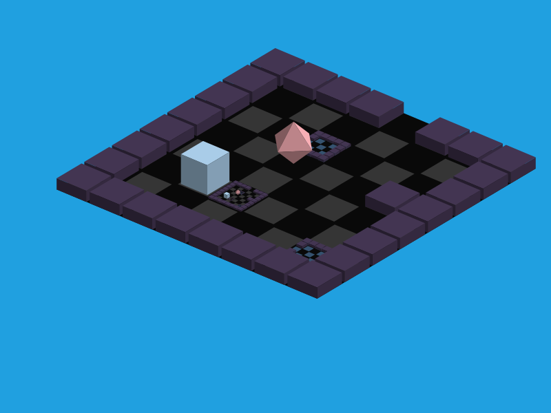

# Paragrid

A visualization system for recursive grid structures with reference semantics and teleportation.



## What is Paragrid?

Paragrid renders **grids within grids** — 2D structures where cells can contain references to other grids, enabling self-reference and mutual recursion. Navigate between nested worlds with cardinal direction movement (N/S/E/W), with automatic entry/exit through reference cells.

### Key Features

- **Recursive Grids**: Grids can reference themselves or other grids, creating infinite nested structures
- **Primary/Secondary References**: Each grid has one primary reference; exiting via secondary refs teleports you to the primary location
- **Two Rendering Modes**:
  - ASCII with color (Python)
  - Isometric 3D with animations (Web/TypeScript)
- **Exact Mathematics**: Uses rational arithmetic (fractions) for pixel-perfect rendering at any scale
- **Interactive Demo**: WASD navigation with smooth animations and SVG export

## Project Structure

```
python/          # Python implementation with ASCII renderer
  paragrid.py    # Core analysis and rendering logic
  test_*.py      # Comprehensive test suite
  venv/          # Virtual environment

web/             # TypeScript/Web implementation
  src/           # Source code with isometric renderer
  demo-iso.html  # Interactive demo (npm run dev)
```

## Quick Start

**Python**:
```bash
source python/venv/bin/activate
python -m pytest python/
```

**Web Demo**:
```bash
cd web
npm install
npm run dev
```

Open the demo and use **WASD** to navigate, **R** to reset. Export the scene as JSON or SVG.

## How It Works

1. **Analyze**: DFS traversal with rational dimensions produces a `CellTree`
2. **Render**: Walk the tree with output-specific rendering logic (ASCII or isometric)
3. **Animate**: Track cell movements and apply direction-aware z-ordering for correct depth

Cycles are handled via configurable dimension thresholds — when nested cells become too small (< 1/32), traversal stops.

---

**Explore recursive grids. Teleport between references. Visualize the infinite.**
