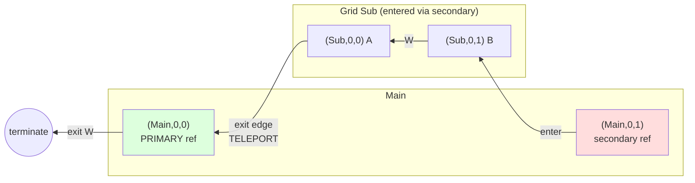

# Paragrid Design

## Data Model

**Grid**: 2D array of cells, identified by string ID. Minimum size 1×2. Grids are defined independently.

**Cell types**:
- `Empty` — no content
- `Concrete(id)` — leaf value (string identifier)
- `Ref(grid_id)` — reference to another grid

**Tagging**: Cell contents (concrete values or grid references) can be tagged with metadata. A user-provided function maps content to a set of tag strings. Tags affect traversal behavior:
- `stop` — Traversal terminates when reaching a cell with this tag

**Primary references**: For each referenced grid, exactly one `Ref` is designated **primary**. All other refs to the same grid are **secondary** — on exit, they teleport to the primary.

**Primary selection**: If not explicitly specified, the primary ref is **auto-selected** as the first `Ref` to that grid found when iterating through the `GridStore` (dictionary iteration order) in row-major order within each grid. This means:
- Grid insertion order into the store matters
- Within a grid, top-to-bottom, left-to-right determines precedence
- A self-reference is automatically primary (being the only ref)

**Cycles allowed**: Grids may reference themselves or form mutual recursion.

---

## Visualization Algorithm

Two-phase approach:

### Phase 1: Analyze
- DFS traversal with rational dimensions (using `Fraction`)
- Root grid starts at width=1, height=1
- Referenced grids fill their parent cell, subdividing dimensions
- Terminates when cell dimension < threshold (default 1/32)
- Produces `CellTree` — a recursive structure of `EmptyNode`, `ConcreteNode`, `NestedNode`

### Phase 2: Render
- Walks `CellTree` with output-specific logic
- Computes LCM of all denominators for exact integer sizing
- Current impl: ASCII with colored outlines (≥3×3 cells) or filled (smaller)

---

## Key Decisions

| Decision | Rationale |
|----------|-----------|
| Single-cell references only | Simplifies geometry; no multi-cell spans |
| Stretch/squash aspect ratio | Grids inherit parent cell shape |
| Rational arithmetic | Exact math, enables LCM scaling for pixel-perfect output |
| Threshold termination | Handles cycles without explicit cycle detection |
| Two-phase analyze/render | Same analysis serves multiple output formats |
| Color by source grid | Visualizes which grid each cell originates from |

---

## Traversal

Given a starting cell, traverse in a cardinal direction, yielding each cell visited.

### Types

```
Direction = N | S | E | W
Cell = (grid_id, row, col)
TryEnter = (grid_id, Direction) -> Optional[Cell]
```

### Function Signature

```
traverse(
    start: Cell,
    direction: Direction,
    try_enter: TryEnter,
    auto_enter: bool = False,
    auto_exit: bool = True,
    max_depth: int = 1000
) -> Iterator[Cell]
```

**Parameters**:
- `auto_enter`: If False (default), yields the Ref cell before entering. If True, **follows the Ref chain** to the final non-Ref destination and yields only that.
- `auto_exit`: If True (default), automatically exits through cascading parent levels. If False, yields the Ref cell on exit and stops.
- `max_depth`: Maximum consecutive auto-jumps to prevent infinite loops (default 1000).

**Termination Reasons**:
Traversal terminates and provides a reason via the iterator result:

- `EDGE_REACHED`: Traversal reached the edge of the root grid
- `ENTRY_CYCLE_DETECTED`: Cycle detected while following a chain of Refs during entry
- `EXIT_CYCLE_DETECTED`: Cycle detected while following exit chain through parent levels
- `PATH_CYCLE_DETECTED`: Position visited twice in the traversal path (only used in push operations)
- `ENTRY_DENIED`: `try_enter` returned `None` (refused entry to a Ref)
- `STOP_TAG`: Encountered a cell tagged with `stop`
- `MAX_DEPTH_REACHED`: Hit the `max_depth` limit for consecutive auto-jumps

**Important distinction**:
- **Entry/Exit cycles** are detected within their respective chain operations (when following Refs on entry or exit). These are separate from the main traversal path.
- **Path cycles** are detected in the main traversal path during push operations, where visiting the same position twice may indicate a successful cycle (if cycling to start) or a failure (if cycling to non-start position).

This allows the same position to be visited multiple times during normal traversal, as long as individual chain operations don't cycle.

### Algorithm

1. **Initialize**: current = start, yield start
2. **Loop**:
   - Compute next coords in current grid based on direction
   - **At edge?**
     - If inside a **secondary** ref: teleport to the **primary** ref of this grid
     - If `auto_exit=False`: yield the Ref cell and terminate
     - If `auto_exit=True`: exit from primary ref's position in its parent grid, continue in same direction
       - If cascading (exiting to another edge): follow exit chain through multiple parent levels
     - If no parent (root grid): terminate
   - Get next cell
   - **If next cell has `stop` tag**: terminate
   - **If next cell is `Ref(target_grid)`**:
     - If `auto_enter=False`: yield the Ref, call `try_enter(target_grid, direction)`
       - If returns `Cell`: move into it, yield it
       - If `None`: terminate
     - If `auto_enter=True`: **follow the reference chain**:
       - Call `try_enter(target_grid, direction)` to get entry position
       - If entry position is a Ref, recursively enter it
       - Continue until reaching a non-Ref cell or detecting a cycle
       - Yield only the final non-Ref destination
       - If `try_enter` returns `None` mid-chain or cycle detected: terminate
   - **If next cell is not a Ref**: yield it

### Reference Chain Following

When `auto_enter=True`, the traversal follows chains of references automatically:

- **Enter chain**: `Ref(A)` → enters A at position with `Ref(B)` → enters B at position with `Concrete(x)` → yields only `x`
- **Entry cycle detection**: Tracks positions visited within each enter chain operation (not entire traversal). If a position is visited twice while following an enter chain, an entry cycle is detected.
- **Entry denial**: If `try_enter` returns `None` at any point in the chain, traversal terminates

This allows references to reference other references, with the system transparently resolving them to the final destination.

### Teleport Semantics

When exiting a grid via a **secondary** reference:
- Teleport to the **primary** reference of that grid
- Exit from the primary's position in its parent

This means secondary refs act as "portals" — you can enter anywhere, but always exit through the primary.

### Exit Chain Following

When exiting through cascading parent levels (exiting to an edge that requires further exit):

- **Exit chain**: Exit from nested grid → lands on Ref in parent → immediately exit through that Ref → lands on another Ref → continue until reaching non-Ref or root edge
- **Exit cycle detection**: Tracks positions visited within each exit chain operation. If a position is visited twice while following an exit chain, an exit cycle is detected.
- **Root exit**: If the exit chain reaches the edge of the root grid (no parent), traversal terminates with `EDGE_REACHED`

This allows automatic cascading exits through multiple nesting levels.

### Worked Example

**Setup**: Grid `Main` (2×2) contains two refs to Grid `Sub`. The left ref is **primary**, the right is **secondary**.

```
Grid Main (2×2):          Grid Sub (1×2):
┌─────────┬─────────┐     ┌───┬───┐
│ Ref(Sub)│ Ref(Sub)│     │ A │ B │
│ PRIMARY │secondary│     └───┴───┘
└─────────┴─────────┘
   col 0     col 1
```

**Traversal**: Start at `(Main, 0, 1)` (the secondary ref), enter Sub, traverse **West**, exit.



**Step-by-step**:

| Step | Position | Action |
|------|----------|--------|
| 1 | `(Main, 0, 1)` | Start at secondary ref. `try_enter(Sub, W)` → enter at `(Sub, 0, 1)` |
| 2 | `(Sub, 0, 1)` | Cell B. Move West. |
| 3 | `(Sub, 0, 0)` | Cell A. Move West → **edge**. |
| 4 | — | Inside secondary ref → **teleport** to primary `(Main, 0, 0)`. |
| 5 | — | Continue West from primary → **edge** of Main → terminate. |

**Key insight**: We entered Sub from the *right* side of Main, but exited to the *left* side — because exit always goes through the primary reference.

---

## Push

The **push** operation moves cell contents along a path in a direction, rotating cells forward when successful.

### Design Specification

**Concept**: Given a starting cell and direction, traverse to build a path of positions, then rotate the cell contents within that path.

**Traversal semantics**:
- Uses `auto_enter=True` and `auto_exit=True` (standard traversal with reference chain following)
- **Special Ref handling**:
  - Call `try_enter(grid_id, direction)` when encountering a Ref
  - **Entry succeeds**: Ref acts as **portal** — NOT included in push path, traversal continues from inside referenced grid
  - **Entry fails** (returns `None`): Ref acts as **solid object** — IS included in push path, traversal continues from next cell in parent grid
- This behavior applies at any nesting depth

**Success conditions** (push is applied):
1. Path ends at an `Empty` cell (termination reason: `EDGE_REACHED`) — traversal stops immediately when Empty is encountered, rotation fills the empty, starting cell becomes empty
2. Path cycles back to starting position (termination reason: `PATH_CYCLE_DETECTED`) — all cells in cycle rotate

**Failure conditions** (push returns `None`, no changes):
- Hit edge of root grid without finding `Empty` (`EDGE_REACHED` but last cell is not Empty)
- Path cycles to non-start position (`PATH_CYCLE_DETECTED` but not cycling to start)
- Entry cycle while following Ref chain (`ENTRY_CYCLE_DETECTED`)
- Exit cycle while following exit chain (`EXIT_CYCLE_DETECTED`)
- Stop tag encountered (`STOP_TAG`)
- Entry denied (`ENTRY_DENIED`)
- Maximum depth reached (`MAX_DEPTH_REACHED`)

**Key behavior**: Traversal terminates immediately upon encountering an Empty cell. The Empty cell is included in the path and becomes the destination for the push. This prevents unnecessary iteration past the target.

**Rotation mechanics**:
- Cell contents shift forward along the path
- Last cell's content moves to first position: `[c1, c2, c3]` → `[c3, c1, c2]`
- Push may affect cells across multiple grids (due to traversing through Refs)
- All affected grids get new immutable instances

**Immutability**: Original `GridStore` unchanged; push returns new `GridStore` or `None`.

### Implementation

**Three-function architecture**:

```python
def push(
    store: GridStore,
    start: CellPosition,
    direction: Direction,
    try_enter: TryEnter,
    max_depth: int = 1000,
) -> GridStore | None
```

Main API that orchestrates traversal and application.

```python
def push_traverse(
    store: GridStore,
    start: CellPosition,
    direction: Direction,
    try_enter: TryEnter,
    max_depth: int = 1000,
) -> tuple[list[tuple[CellPosition, Cell]], TerminationReason]
```

Custom traversal that tracks original cell contents and implements Ref-as-object fallback.

Returns a tuple of:
- `path`: List of `(position, original_cell)` tuples representing cells visited
- `reason`: Termination reason (see below for specific meanings in push context)

```python
def apply_push(
    store: GridStore,
    path: list[tuple[CellPosition, Cell]],
) -> GridStore
```

Rotates cell contents and creates new Grid instances (immutable reconstruction).

**Key algorithm details**:

1. **push_traverse()**: Similar to `traverse()` but:
   - Returns list of `(position, original_cell)` tuples
   - When encountering Ref: try to enter first
   - If entry succeeds: pop Ref from path, follow enter chain via `_follow_enter_chain()`
   - If entry fails: keep Ref in path, continue from next cell in same grid
   - Cycle detection: track visited positions, success if cycling to start

2. **apply_push()**:
   - Extract cells: `[cell1, cell2, ..., cellN]`
   - Rotate right: `[cellN, cell1, ..., cellN-1]`
   - Group updates by `grid_id`
   - For each affected grid: convert to mutable list, apply updates, convert back to tuple
   - Create new `Grid` instances, return new `GridStore`

3. **push()**:
   - Call `push_traverse()` to get path and reason
   - Check success conditions (Empty at end OR cycle to start)
   - If success: call `apply_push()` and return new store
   - Otherwise: return `None`

**Reuses from traversal**:
- `find_primary_ref()` — for exit/teleportation logic
- `_follow_enter_chain()` — for Ref chain traversal
- Direction deltas — same cardinal direction movement
- `TerminationReason` enum — shared termination semantics

**Edge cases**:
- Single-cell path (start at Empty): Valid but no-op
- Start at inaccessible Ref: Ref pushed as solid object
- Multi-level nesting: Enter chain handles depth automatically
- Exit via secondary ref: Teleports to primary correctly
- Cycle in Ref chain during entry: Detected by `_follow_enter_chain()`, push fails
- Invalid cycle (to non-start): Detected and rejected

### Example: Push Through Portal

**Setup**:
```
Grid Main (1×3):         Grid Inner (1×2):
┌───┬──────────┬───┐     ┌───┬───┐
│ A │ Ref(Inner)│ B │     │ X │ Y │
└───┴──────────┴───┘     └───┴───┘
     col 0    1    2          0   1
```

**Operation**: `push(store, CellPosition("Main", 0, 0), Direction.E, try_enter)`

Assume `try_enter` allows entry from East at `Inner[0, 0]`.

**Traversal**:
1. Start at `Main[0,0]` (cell A) → add to path
2. Move East to `Main[0,1]` (Ref) → try_enter succeeds
3. Pop Ref, enter at `Inner[0,0]` (cell X) → add to path
4. Move East to `Inner[0,1]` (cell Y) → add to path
5. Move East → hit edge, exit via primary (same Ref)
6. Continue from `Main[0,1]` + East = `Main[0,2]` (cell B) → add to path
7. Move East → hit edge of root grid, terminate with EDGE_REACHED

**Path**: `[(Main[0,0], A), (Inner[0,0], X), (Inner[0,1], Y), (Main[0,2], B)]`

**Check termination**: Last cell B is not Empty → push fails, return `None`.

**Alternative**: If cell B were Empty:

**Path**: `[(Main[0,0], A), (Inner[0,0], X), (Inner[0,1], Y), (Main[0,2], Empty)]`

**Rotation**: `[A, X, Y, Empty]` → `[Empty, A, X, Y]`

**Result**:
```
Grid Main (1×3):         Grid Inner (1×2):
┌─────┬──────────┬───┐   ┌───┬───┐
│Empty│ Ref(Inner)│ Y │   │ A │ X │
└─────┴──────────┴───┘   └───┴───┘
```

**Key insight**: The push moved contents through the Ref portal, affecting both grids. The Ref itself didn't move.

### Example: Push Blocked by Ref

**Setup**:
```
Grid Main (1×3):
┌───┬──────────┬─────┐
│ A │ Ref(Lock)│Empty│
└───┴──────────┴─────┘
     col 0    1     2
```

**Operation**: `push(store, CellPosition("Main", 0, 0), Direction.E, try_enter)`

Assume `try_enter` **denies** entry to "Lock" grid (returns `None`).

**Traversal**:
1. Start at `Main[0,0]` (cell A) → add to path
2. Move East to `Main[0,1]` (Ref) → try_enter returns `None`
3. Keep Ref in path (solid object), continue from `Main[0,1]` + East = `Main[0,2]`
4. At `Main[0,2]` (Empty) → success!

**Path**: `[(Main[0,0], A), (Main[0,1], Ref(Lock)), (Main[0,2], Empty)]`

**Rotation**: `[A, Ref(Lock), Empty]` → `[Empty, A, Ref(Lock)]`

**Result**:
```
Grid Main (1×3):
┌─────┬───┬──────────┐
│Empty│ A │ Ref(Lock)│
└─────┴───┴──────────┘
```

**Key insight**: When entry is denied, the Ref cell itself gets pushed like a `Concrete` cell.

### Push with Backtracking

The default push algorithm (`push()`) includes backtracking to maximize success rate when pushing through Refs.

**Problem**: In the simple algorithm, if `try_enter()` succeeds and traversal enters a referenced grid, any failure inside that grid (stop tag, entry denial, edge without Empty) causes the entire push to fail with no fallback.

**Solution**: Track "decision points" where we enter Refs as portals. When push fails after entering, automatically backtrack to the last decision point and retry with that Ref treated as a solid object.

**Backtracking mechanism**:
1. **Decision tracking**: Each successful Ref entry creates a `DecisionPoint` that saves:
   - Ref position and cell
   - Path state before entering
   - Visited set before entering
   - Traversal depth at that point

2. **Failure detection**: On any termination that's not a valid success:
   - Check if decision stack is not empty and backtrack count < max_backtrack_depth
   - Pop last DecisionPoint
   - Mark that Ref as "blocked" (treat as solid going forward)
   - Restore state to just before that decision
   - Add the Ref to path as solid and continue traversal

3. **Multi-level support**: Supports multiple levels of backtracking for nested Refs. Each backtrack pops one decision point and marks one Ref as blocked.

**Blocked Refs tracking**: After backtracking from a Ref, that specific Ref position is marked in `blocked_refs` set. During subsequent traversal, blocked Refs are immediately treated as solid objects without attempting portal entry.

**Termination**: Backtracking stops when:
- Push succeeds (ends at Empty or cycles to start)
- No more decision points remain
- `max_backtrack_depth` is exceeded (default 10)
- All backtracking attempts fail

**Simple algorithm**: For testing or when deterministic behavior is needed without backtracking overhead, use `push_simple()` which fails immediately without retry when portal path fails.

**Example**:
```
Setup: Grid Main: [A, Ref(inner), Empty]
       Grid Inner: [X, STOP]
```

With `push_simple()`:
1. Start at A, move East to Ref
2. `try_enter` succeeds → enter Inner as portal
3. Arrive at X, move East to STOP
4. Check stop tag → terminates with STOP_TAG
5. **Push fails**, returns None

With `push()` (backtracking):
1. Start at A, move East to Ref
2. `try_enter` succeeds → create DecisionPoint, enter Inner as portal
3. Arrive at X, move East to STOP
4. Check stop tag → triggers backtracking
5. **Backtrack**: restore to before Ref entry, mark Ref as blocked
6. Add Ref to path as solid (blocked), continue East to Empty
7. **Push succeeds**: rotate [A, Ref(inner), Empty] → [Empty, A, Ref(inner)]

**Key insight**: Backtracking enables pushes that would otherwise fail, by automatically trying alternative interpretations of Refs (portal vs solid) when the initial choice doesn't work out.

---

## Type Notes

- Uses `mypy --strict`
- `simple_chalk` lacks stubs; use `# type: ignore[import-untyped]` or add stubs path to `MYPYPATH`
