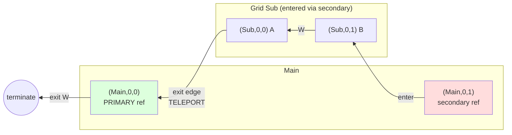

# Paragrid Design

## Data Model

**Grid**: 2D array of cells, identified by string ID. Minimum size 1×2. Grids are defined independently.

**Cell types**:
- `Empty` — no content
- `Concrete(id)` — leaf value (string identifier)
- `Ref(grid_id)` — reference to another grid

**Primary references**: For each referenced grid, exactly one `Ref` is designated **primary**. All other refs to the same grid are **secondary** — on exit, they teleport to the primary.

**Primary selection**: If not explicitly specified, the primary ref is **auto-selected** as the first `Ref` to that grid found when iterating through the `GridStore` (dictionary iteration order) in row-major order within each grid. This means:
- Grid insertion order into the store matters
- Within a grid, top-to-bottom, left-to-right determines precedence
- A self-reference is automatically primary (being the only ref)

**Cycles allowed**: Grids may reference themselves or form mutual recursion.

---

## Visualization Algorithm

Two-phase approach:

### Phase 1: Analyze
- DFS traversal with rational dimensions (using `Fraction`)
- Root grid starts at width=1, height=1
- Referenced grids fill their parent cell, subdividing dimensions
- Terminates when cell dimension < threshold (default 1/32)
- Produces `CellTree` — a recursive structure of `EmptyNode`, `ConcreteNode`, `NestedNode`

### Phase 2: Render
- Walks `CellTree` with output-specific logic
- Computes LCM of all denominators for exact integer sizing
- Current impl: ASCII with colored outlines (≥3×3 cells) or filled (smaller)

---

## Key Decisions

| Decision | Rationale |
|----------|-----------|
| Single-cell references only | Simplifies geometry; no multi-cell spans |
| Stretch/squash aspect ratio | Grids inherit parent cell shape |
| Rational arithmetic | Exact math, enables LCM scaling for pixel-perfect output |
| Threshold termination | Handles cycles without explicit cycle detection |
| Two-phase analyze/render | Same analysis serves multiple output formats |
| Color by source grid | Visualizes which grid each cell originates from |

---

## Traversal

Given a starting cell, traverse in a cardinal direction, yielding each cell visited.

### Types

```
Direction = N | S | E | W
Cell = (grid_id, row, col)
TryEnter = (grid_id, Direction) -> Optional[Cell]
```

### Function Signature

```
traverse(
    start: Cell,
    direction: Direction,
    try_enter: TryEnter,
    auto_enter: bool = False,
    auto_exit: bool = True,
    max_depth: int = 1000
) -> Iterator[Cell]
```

**Parameters**:
- `auto_enter`: If False (default), yields the Ref cell before entering. If True, **follows the Ref chain** to the final non-Ref destination and yields only that.
- `auto_exit`: If True (default), automatically exits through cascading parent levels. If False, yields the Ref cell on exit and stops.
- `max_depth`: Maximum consecutive auto-jumps to prevent infinite loops (default 1000).

### Algorithm

1. **Initialize**: current = start, yield start
2. **Loop**:
   - Compute next coords in current grid based on direction
   - **At edge?**
     - If inside a **secondary** ref: teleport to the **primary** ref of this grid
     - If `auto_exit=False`: yield the Ref cell and terminate
     - If `auto_exit=True`: exit from primary ref's position in its parent grid, continue in same direction
       - If cascading (exiting to another edge): follow exit chain through multiple parent levels
     - If no parent (root grid): terminate
   - Get next cell
   - **If next cell is `Ref(target_grid)`**:
     - If `auto_enter=False`: yield the Ref, call `try_enter(target_grid, direction)`
       - If returns `Cell`: move into it, yield it
       - If `None`: terminate
     - If `auto_enter=True`: **follow the reference chain**:
       - Call `try_enter(target_grid, direction)` to get entry position
       - If entry position is a Ref, recursively enter it
       - Continue until reaching a non-Ref cell or detecting a cycle
       - Yield only the final non-Ref destination
       - If `try_enter` returns `None` mid-chain or cycle detected: terminate
   - **If next cell is not a Ref**: yield it

### Reference Chain Following

When `auto_enter=True`, the traversal follows chains of references automatically:

- **Enter chain**: `Ref(A)` → enters A at position with `Ref(B)` → enters B at position with `Concrete(x)` → yields only `x`
- **Cycle detection**: Tracks positions visited within each chain operation (not entire traversal)
- **Entry denial**: If `try_enter` returns `None` at any point in the chain, traversal terminates

This allows references to reference other references, with the system transparently resolving them to the final destination.

### Teleport Semantics

When exiting a grid via a **secondary** reference:
- Teleport to the **primary** reference of that grid
- Exit from the primary's position in its parent

This means secondary refs act as "portals" — you can enter anywhere, but always exit through the primary.

### Worked Example

**Setup**: Grid `Main` (2×2) contains two refs to Grid `Sub`. The left ref is **primary**, the right is **secondary**.

```
Grid Main (2×2):          Grid Sub (1×2):
┌─────────┬─────────┐     ┌───┬───┐
│ Ref(Sub)│ Ref(Sub)│     │ A │ B │
│ PRIMARY │secondary│     └───┴───┘
└─────────┴─────────┘
   col 0     col 1
```

**Traversal**: Start at `(Main, 0, 1)` (the secondary ref), enter Sub, traverse **West**, exit.



**Step-by-step**:

| Step | Position | Action |
|------|----------|--------|
| 1 | `(Main, 0, 1)` | Start at secondary ref. `try_enter(Sub, W)` → enter at `(Sub, 0, 1)` |
| 2 | `(Sub, 0, 1)` | Cell B. Move West. |
| 3 | `(Sub, 0, 0)` | Cell A. Move West → **edge**. |
| 4 | — | Inside secondary ref → **teleport** to primary `(Main, 0, 0)`. |
| 5 | — | Continue West from primary → **edge** of Main → terminate. |

**Key insight**: We entered Sub from the *right* side of Main, but exited to the *left* side — because exit always goes through the primary reference.

---

## Type Notes

- Uses `mypy --strict`
- `simple_chalk` lacks stubs; use `# type: ignore[import-untyped]` or add stubs path to `MYPYPATH`
