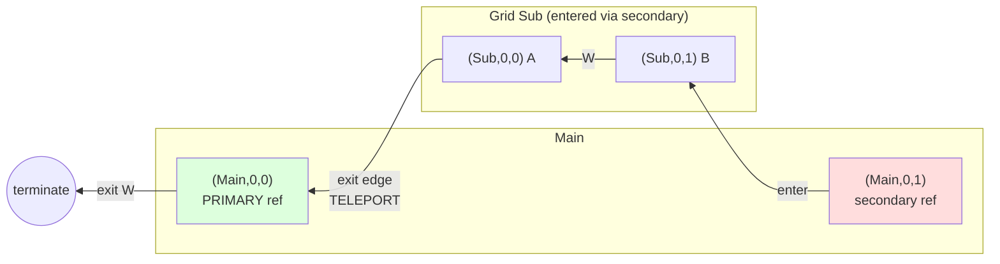

# Paragrid Design

## Data Model

**Grid**: 2D array of cells, identified by string ID. Minimum size 1×2. Grids are defined independently.

**Cell types**:
- `Empty` — no content
- `Concrete(id)` — leaf value (string identifier)
- `Ref(grid_id)` — reference to another grid

**Tagging**: Cell contents (concrete values or grid references) can be tagged with metadata. A user-provided function maps content to a set of tag strings. Tags affect push behavior:
- `stop` — Push operations cannot be initiated from stop-tagged cells (they are immovable), and push terminates when encountering a stop-tagged cell

**Primary references**: For each referenced grid, exactly one `Ref` is designated **primary**. All other refs to the same grid are **secondary** — on exit, they teleport to the primary.

**Primary selection**: If not explicitly specified, the primary ref is **auto-selected** as the first `Ref` to that grid found when iterating through the `GridStore` (dictionary iteration order) in row-major order within each grid. This means:
- Grid insertion order into the store matters
- Within a grid, top-to-bottom, left-to-right determines precedence
- If there's only one reference to a grid (including self-references), it becomes the primary by default

**Cycles allowed**: Grids may reference themselves or form mutual recursion.

---

## Visualization Algorithm

Two-phase approach:

### Phase 1: Analyze
- DFS traversal with rational dimensions (using `Fraction`)
- Root grid starts at width=1, height=1
- Referenced grids fill their parent cell, subdividing dimensions
- Terminates when cell dimension < threshold (default 1/32)
- Produces `CellTree` — a recursive structure of `EmptyNode`, `ConcreteNode`, `NestedNode`

### Phase 2: Render
- Walks `CellTree` with output-specific logic
- Computes LCM of all denominators for exact integer sizing
- Current impl: ASCII with colored outlines (≥3×3 cells) or filled (smaller)

---

## Isometric Rendering

The isometric renderer builds 3D scenes using the ts-poly library, which provides template instancing and ID-based animation.

### Template System

To efficiently handle recursive grids (including self-references), the renderer uses ts-poly's template system:

**Template creation**: Each unique `NestedNode` instance (by object identity) becomes a template. For a self-referencing grid, different depth levels are different instances:
- Depth 0 → template-0
- Depth 1 → template-1
- Depth 2 → template-2
- ...until cutoff threshold

**Root grid direct rendering**: The root grid (containing the player) is rendered directly into the scene graph (not as a template). This allows individual cells to be animated.

**Template references**: When a root grid cell contains a reference, it uses `builder.reference(templateId, ...)` to instantiate that template's geometry.

**Visual representation** of a self-referencing grid:

```
Analyzer Output (CellTree):
  NestedNode@depth0 (gridId="main")
    ├─ ConcreteNode(id="1")
    ├─ RefNode → NestedNode@depth1 (gridId="main")  ← different instance!
    │            ├─ ConcreteNode(id="1")
    │            ├─ RefNode → NestedNode@depth2 (gridId="main")
    │            │            ├─ ConcreteNode(id="1")
    │            │            └─ CutoffNode  ← stopped here
    │            └─ ...
    └─ ...

Renderer Output (ts-poly scene):
  template-1:  ← built first (deepest)
    - cell with concrete-1 group
    - cell with reference to template-2

  template-0:  ← built second
    - cell with concrete-1 group
    - cell with reference to template-1

  Root scene:  ← built last
    - cell with concrete-1 group (directly in scene)
    - cell with reference to template-0
```

**Build order**: Templates must be built in reverse order (deepest first) so child templates exist before parents reference them.

### Hierarchy and IDs

Both root grid and templates use a consistent three-level hierarchy to enable ID-based animation:

```
Root Grid Structure:
  cell group (at grid position [x, 0, z])
    └─ content group ID="concrete-1" (at [0, 0, 0])
         └─ instance (no ID)

Template Structure:
  cell group (at centered position [x', 0, z'])
    └─ content group ID="concrete-1" (at [0, 0, 0])
         └─ instance (no ID)
```

**Key principle**: IDs are attached to groups (which can be transformed), not instances (which cannot). When ts-poly animates ID `concrete-1`, all groups with that ID move together - whether in the root grid or nested inside templates at any depth. The content group at `[0,0,0]` is convention; animation transforms are relative to whatever position is set.

### Animation System

ts-poly provides ID-based animation where all nodes with the same ID receive the same animation transform:

```
Animation clip targets ID "concrete-1":
  position: [0,0,0] → [1,0,0] over 0.3s

Result: ALL groups with ID "concrete-1" animate together:
  - Root grid instance ✓
  - Template instance at depth 1 ✓
  - Template instance at depth 2 ✓
  - etc.
```

This enables synchronized animation of a cell and all its recursive clones.

### Coordinate Spaces

**Template centering**: Templates position their cells centered around the origin:
```
3×3 grid cells at:  [−1, 0], [0, 0], [1, 0]  (col 0, 1, 2)
                    [−1, 1], [0, 1], [1, 1]
                    [−1, 2], [0, 2], [1, 2]
```

This eliminates the need for centering translation when referencing templates. References only apply scale, keeping transform hierarchies simple.

### Example: Self-Reference Animation

**Grid setup**:
```
main: [concrete-1, Ref(main), concrete-2]
```

**Scene graph** (simplified, 2 depth levels):
```
root-cell-0-0 [position: [-1, 0, 0]]
  └─ concrete-1 [position: [0, 0, 0]]  ← animated
       └─ cube instance

root-cell-0-1 [position: [0, 0, 0]]
  └─ ref-main-auto [position: [0, 0, 0]]
       └─ reference to template-0 [scale: [0.33, 0.33, 0.33]]
            └─ template-0-cell-0-0 [position: [-1, 0, 0]]
                 └─ concrete-1 [position: [0, 0, 0]]  ← animated (clone)
                      └─ cube instance
            ... (other template cells)

root-cell-0-2 [position: [1, 0, 0]]
  └─ concrete-2 [position: [0, 0, 0]]
       └─ cube instance
```

**Animation behavior**: When `concrete-1` animates (e.g., moves east):
- Both `concrete-1` groups receive `position: [0,0,0] → [1,0,0]` transform
- Root instance moves from `[-1, 0, 0]` to `[0, 0, 0]` in world space
- Template clone moves within the scaled template coordinate space
- Both animate synchronously ✓

### Current Limitation: Position Overrides

For direction-aware animation, the root grid uses `cellPositionOverrides` to position certain cells at their OLD position before animating to NEW:

```typescript
// Away-from-camera: place hierarchy at OLD position
cellPositionOverrides.set('concrete-1', { row: 0, col: 0 });
// Then animate to NEW position
```

**Problem**: Position overrides only affect root grid cell group positioning, not template instances. Template instances are positioned based on the analyzed grid structure and cannot be repositioned via this mechanism.

**Visual example** of the problem:

```
Scenario: concrete-1 moved from [0,0] to [1,0] (away from camera)

Root grid (with position override):
  root-cell-0-0 [position: [0, 0, 0]]  ← override places at OLD position
    └─ concrete-1 [animated: [0,0,0] → [1,0,0]]
         └─ cube
  Result: animates from [0,0,0] to [1,0,0] ✓ CORRECT

Template (cannot use position override):
  template-0-cell-0-1 [position: [1, 0, 0]]  ← positioned at NEW (no override)
    └─ concrete-1 [animated: [0,0,0] → [1,0,0]]
         └─ cube
  Result: starts at [1,0,0], animates to [2,0,0], snaps back ✗ WRONG
```

**Why overrides don't work**: The `cellPositionOverrides` map affects scene building logic in `renderGridDirect()`, which only builds the root grid. Templates are built separately by `buildGridTemplate()` and instantiated via `builder.reference()`. The override mechanism has no way to reach into template instances.

**Proposed solution**: See `ts-poly-id-override-proposal.md` for ID-based transform overrides that would apply uniformly across all template depths during projection.

---

## Key Decisions

| Decision | Rationale |
|----------|-----------|
| Single-cell references only | Simplifies geometry; no multi-cell spans |
| Stretch/squash aspect ratio | Grids inherit parent cell shape |
| Rational arithmetic | Exact math, enables LCM scaling for pixel-perfect output |
| Threshold termination | Handles cycles without explicit cycle detection |
| Two-phase analyze/render | Same analysis serves multiple output formats |
| Color by source grid | Visualizes which grid each cell originates from |

---

## Grid Navigation Concepts

These concepts govern how movement works through the grid structure. They are implemented by the Navigator class and used by push operations.

### Types

```
Direction = N | S | E | W
CellPosition = (grid_id, row, col)
```

**Entry Convention**: When entering a grid via a Ref, the standard convention is to enter at the **middle of the edge** corresponding to the direction of entry:
- **East** (entering from left): `(rows // 2, 0)` — middle of left edge
- **West** (entering from right): `(rows // 2, cols - 1)` — middle of right edge
- **South** (entering from top): `(0, cols // 2)` — middle of top edge
- **North** (entering from bottom): `(rows - 1, cols // 2)` — middle of bottom edge

When the dimension is even, round down (use integer division). For example, a 4-row grid entered from the East enters at row 2 (index counting from 0).

### Ancestor-Based Entry Strategy

**Motivation**: The standard middle-of-edge entry works for simple cases, but doesn't preserve positional continuity when exiting one grid and immediately entering another. When pushing through multiple grids, we want top-row exits to lead to top-row entries, bottom to bottom, etc., creating smooth spatial flow.

**Concept**: Track the exit position when leaving a grid, then map that position through a common ancestor coordinate system to determine the entry position in the target grid. This creates consistent positional alignment without needing depth tracking.

#### Cell Center Positioning Model

The algorithm uses a **center-based positioning model** with rational arithmetic:

- **Cell centers** are positioned at `(i+1)/(N+1)` for cell index `i` in dimension `N`
- **Cell boundaries** are at the midpoints between adjacent centers, with edges at 0 and 1
- Uses `Fraction` for exact arithmetic (no floating point errors)

**Examples**:
- 1 cell: center at 1/2, occupies [0, 1]
- 2 cells: centers at 1/3, 2/3; boundaries at [0, 1/2], [1/2, 1]
- 3 cells: centers at 1/4, 2/4, 3/4; boundaries at [0, 3/8], [3/8, 5/8], [5/8, 1]
- 5 cells: centers at 1/6, 2/6, 3/6, 4/6, 5/6

This model creates **unequal cell heights** (outer cells are taller than inner cells), but ensures consistent fractional positioning across different grid sizes.

#### Algorithm

When exiting a grid and entering a Ref in the same traversal:

1. **Capture exit state** (during `try_advance()`):
   - Store `exit_grid_id` (which grid we exited from)
   - Store `exit_position` (row, col) at exit

2. **Compute common ancestor** (during `try_enter()`):
   - Navigator is positioned at the Ref cell after advancing
   - The Ref's parent grid (`current.grid_id`) is the common ancestor

3. **Map exit position up to ancestor**:
   - Start with exit cell center in exit grid's coordinate space
   - For each parent level: map child [0,1] space → parent cell extent
   - Stop when reaching common ancestor grid

4. **Map ancestor position down to target**:
   - Start with position in ancestor's coordinate space
   - For each child level: map parent cell extent → child [0,1] space
   - Find nearest cell center in target grid

**Worked example**: Exit from C[1] (middle of 3 rows) → enter E (5 rows), both nested at depth 2

```
Root (1 row × 2 cols):
┌───────┬───────┐
│ Ref(B)│ Ref(D)│
└───────┴───────┘

Grid B (2 rows):        Grid D (2 rows):
┌───────┐               ┌───────┐
│ Ref(C)│ ← row 0       │ Ref(E)│ ← row 0
├───────┤               ├───────┤
│ Empty │ ← row 1       │ Empty │ ← row 1
└───────┘               └───────┘

Grid C (3 rows):        Grid E (5 rows):
┌─────┐                 ┌─────┐
│  X  │ ← row 0 (1/4)   │  1  │ ← row 0 (1/6)
├─────┤                 ├─────┤
│  Y  │ ← row 1 (2/4)   │  2  │ ← row 1 (2/6)
├─────┤                 ├─────┤
│  Z  │ ← row 2 (3/4)   │  3  │ ← row 2 (3/6) ← entry!
└─────┘                 ├─────┤
                        │  4  │ ← row 3 (4/6)
                        ├─────┤
                        │  5  │ ← row 4 (5/6)
                        └─────┘
```

**Calculation**:
1. Exit C[1]: center at 2/4 = 1/2 in C's space
2. Map to B: C occupies B[0], which spans [0, 1/2] in B's space
   - C's [0, 1] → B's [0, 1/2]
   - C's 1/2 → B's 1/4
3. Map to Root: B occupies Root[0] (entire row), spans [0, 1]
   - B's [0, 1] → Root's [0, 1]
   - B's 1/4 → Root's 1/4
4. Common ancestor: Root (containing both Ref(B) and Ref(D))
5. Map to D: D occupies Root[0] (entire row), spans [0, 1]
   - Root's [0, 1] → D's [0, 1]
   - Root's 1/4 → D's 1/4
6. Map to E: E occupies D[0], which spans [0, 1/2] in D's space
   - D's [0, 1/2] → E's [0, 1]
   - D's 1/4 → E's 1/2
7. Find nearest cell in E: 1/2 is closest to E[2] center (3/6 = 1/2)
8. **Result**: Enter at E[2] (middle row)

**Key properties**:
- **No depth tracking**: Uses grid hierarchy, not enter/exit counts
- **Works across any depth difference**: Same-level, cross-level, and mismatched depths
- **Exact arithmetic**: Uses `Fraction` for perfect reproducibility
- **Common ancestor optimization**: Only maps through necessary ancestor chain
- **Fallback**: Uses standard middle-of-edge when no exit info available

#### Implementation Notes

**Navigator state**:
- `exit_grid_id: str | None` — Grid we exited from
- `exit_position: tuple[int, int] | None` — (row, col) at exit

**Entry logic** (in `try_enter()`):
```python
if exit_grid_id is not None and exit_position is not None:
    # Current position is the Ref - its grid is common ancestor
    ancestor_grid_id = current.grid_id

    # Map exit position up to ancestor
    exit_fraction = compute_exit_ancestor_fraction(
        store, exit_grid_id, exit_index, dimension_attr,
        stop_at_ancestor=ancestor_grid_id
    )

    # Map down from ancestor to target
    entry_index = compute_entry_from_ancestor_fraction(
        store, target_grid_id, exit_fraction, dimension_attr,
        ancestor_grid_id=ancestor_grid_id
    )
else:
    # No exit info - use standard middle-of-edge entry
    entry_index = standard_entry(...)
```

### Teleport Semantics

When exiting a grid via a **secondary** reference:
- Teleport to the **primary** reference of that grid
- Exit from the primary's position in its parent

This means secondary refs act as "portals" — you can enter anywhere, but always exit through the primary.

### Exit Chain Following

When exiting through cascading parent levels (exiting to an edge that requires further exit):

- **Exit chain**: Exit from nested grid → lands on Ref in parent → immediately exit through that Ref → lands on another Ref → continue until reaching non-Ref or root edge
- **Exit cycle detection**: Tracks positions visited within each exit chain operation. If a position is visited twice while following an exit chain, an exit cycle is detected.
- **Root exit**: If the exit chain reaches the edge of the root grid (no parent), traversal terminates with `EDGE_REACHED`

This allows automatic cascading exits through multiple nesting levels.

### Worked Example

**Setup**: Grid `Main` (2×2) contains two refs to Grid `Sub`. The left ref is **primary**, the right is **secondary**.

```
Grid Main (2×2):          Grid Sub (1×2):
┌─────────┬─────────┐     ┌───┬───┐
│ Ref(Sub)│ Ref(Sub)│     │ A │ B │
│ PRIMARY │secondary│     └───┴───┘
└─────────┴─────────┘
   col 0     col 1
```

**Traversal**: Start at `(Main, 0, 1)` (the secondary ref), enter Sub, traverse **West**, exit.



**Step-by-step**:

| Step | Position | Action |
|------|----------|--------|
| 1 | `(Main, 0, 1)` | Start at secondary ref. `try_enter(Sub, W)` → enter at `(Sub, 0, 1)` |
| 2 | `(Sub, 0, 1)` | Cell B. Move West. |
| 3 | `(Sub, 0, 0)` | Cell A. Move West → **edge**. |
| 4 | — | Inside secondary ref → **teleport** to primary `(Main, 0, 0)`. |
| 5 | — | Continue West from primary → **edge** of Main → terminate. |

**Key insight**: We entered Sub from the *right* side of Main, but exited to the *left* side — because exit always goes through the primary reference.

---

## Push

The **push** operation moves cell contents along a path in a direction, rotating cells forward when successful.

### Rule Sets

Operations in Paragrid are governed by **rule sets** that control how various interactions are handled. Each operation (currently just push) requires a rule set parameter.

**Rule Set Options**:
- `ref_strategy`: Controls the order in which Ref handling strategies are attempted
  - **DEFAULT** (SOLID → PORTAL → SWALLOW): Try pushing ref as solid object first, then try entering as portal, finally try swallowing
  - **TRY_ENTER_FIRST** (PORTAL → SOLID → SWALLOW): Try entering as portal first, then pushing as solid, finally swallowing
  - **PUSH_FIRST** (SOLID → PORTAL → SWALLOW): Same as DEFAULT
  - **SWALLOW_FIRST** (SWALLOW → PORTAL → SOLID): Try swallowing first, then portal, then solid

The rule set determines the order strategies are attempted, affecting both the primary operation and backtracking logic. With backtracking enabled (in `push()`), if the first strategy fails, the system automatically tries the next strategy in the ordering.

### Design Specification

**Concept**: Given a starting cell, direction, and rule set, traverse to build a path of positions, then rotate the cell contents within that path.

**Success conditions** (push returns new GridStore):
1. Path ends at an `Empty` cell — traversal stops immediately when Empty is encountered, rotation fills the empty, starting cell becomes empty
2. Path cycles back to starting position — all cells in cycle rotate

**Failure conditions** (push returns `PushFailure` with reason):
- **BLOCKED**: Cannot advance from start position (hit edge immediately)
- **STOP_TAG**: Attempting to push from a stop-tagged cell, or encountered a stop-tagged cell during traversal
- **PATH_CYCLE**: Path cycled to a non-start position
- **NO_STRATEGY**: No applicable strategy available (all strategies failed or no strategies apply)
- **MAX_DEPTH**: Exceeded maximum depth limit

**Key behavior**: Traversal terminates immediately upon encountering an Empty cell. The Empty cell is included in the path and becomes the destination for the push. This prevents unnecessary iteration past the target.

**Rotation mechanics**:
- Cell contents shift forward along the path
- Last cell's content moves to first position: `[c1, c2, c3]` → `[c3, c1, c2]`
- Push may affect cells across multiple grids (due to traversing through Refs)
- All affected grids get new immutable instances

**Immutability**: Original `GridStore` unchanged; push returns new `GridStore` or `PushFailure`.

### Implementation

**Core Architecture**:

The push implementation uses a **Navigator** abstraction for grid traversal combined with a **backtracking decision stack** for trying multiple strategies.

**Main Functions**:

```python
def push(
    store: GridStore,
    start: CellPosition,
    direction: Direction,
    rules: RuleSet,
    tag_fn: TagFn | None = None,
    max_depth: int = 1000,
    max_backtrack_depth: int = 10,
) -> GridStore | PushFailure
```

Main API with backtracking support. Returns new GridStore on success or PushFailure with detailed reason on failure.

```python
def push_simple(
    store: GridStore,
    start: CellPosition,
    direction: Direction,
    rules: RuleSet,
    tag_fn: TagFn | None = None,
    max_depth: int = 1000,
) -> GridStore | PushFailure
```

Simpler version without backtracking. Fails immediately if initial strategy doesn't work.

```python
def apply_push(
    store: GridStore,
    path: list[tuple[CellPosition, Cell]],
) -> GridStore
```

Rotates cell contents along the path and creates new Grid instances (immutable reconstruction).

**Key algorithm (push with backtracking)**:

1. Check if start cell has stop tag → fail immediately with STOP_TAG
2. Create Navigator at start position
3. Try to advance one step → if blocked, return BLOCKED failure
4. Create initial state (check for immediate Empty/cycle/failure)
5. Main loop with decision stack:
   - Pop a state from the stack
   - If state has no strategies left, backtrack
   - Try next strategy (solid/portal/swallow) from the state
   - Apply strategy using Navigator (advance/enter/flip as needed)
   - Create new state from result
   - If success → build final path and apply_push
   - If failure → store as last_failure and continue
   - If new state → push to decision stack
6. If all states exhausted → return last_failure

**Edge cases**:
- Immediate success (advance lands on Empty): Build path and apply
- Stop-tagged start cell: Fail with STOP_TAG before any movement
- Multi-level nesting: Navigator handles automatically
- Exit via secondary ref: Navigator teleports to primary
- Cycle detection: Tracked in visited set

### Example: Push Through Portal

**Setup**:
```
Grid Main (1×3):         Grid Inner (1×2):
┌───┬──────────┬───┐     ┌───┬───┐
│ A │ Ref(Inner)│ B │     │ X │ Y │
└───┴──────────┴───┘     └───┴───┘
     col 0    1    2          0   1
```

**Operation**: `push(store, CellPosition("Main", 0, 0), Direction.E, rules)`

With default rules (SOLID → PORTAL → SWALLOW), the Ref will first be tried as a solid object. If we assume that fails and it tries PORTAL, entry from East enters at `Inner[0, 0]` (middle of left edge).

**Traversal**:
1. Start at `Main[0,0]` (cell A) → add to path
2. Move East to `Main[0,1]` (Ref) → try_enter succeeds
3. Pop Ref, enter at `Inner[0,0]` (cell X) → add to path
4. Move East to `Inner[0,1]` (cell Y) → add to path
5. Move East → hit edge, exit via primary (same Ref)
6. Continue from `Main[0,1]` + East = `Main[0,2]` (cell B) → add to path
7. Move East → hit edge of root grid, terminate with EDGE_REACHED

**Path**: `[(Main[0,0], A), (Inner[0,0], X), (Inner[0,1], Y), (Main[0,2], B)]`

**Check termination**: Last cell B is not Empty → push fails, return `PushFailure` with reason NO_STRATEGY.

**Alternative**: If cell B were Empty:

**Path**: `[(Main[0,0], A), (Inner[0,0], X), (Inner[0,1], Y), (Main[0,2], Empty)]`

**Rotation**: `[A, X, Y, Empty]` → `[Empty, A, X, Y]`

**Result**:
```
Grid Main (1×3):         Grid Inner (1×2):
┌─────┬──────────┬───┐   ┌───┬───┐
│Empty│ Ref(Inner)│ Y │   │ A │ X │
└─────┴──────────┴───┘   └───┴───┘
```

**Key insight**: The push moved contents through the Ref portal, affecting both grids. The Ref itself didn't move.

### Example: Push Blocked by Ref

**Setup**:
```
Grid Main (1×3):
┌───┬──────────┬─────┐
│ A │ Ref(Lock)│Empty│
└───┴──────────┴─────┘
     col 0    1     2
```

**Operation**: `push(store, CellPosition("Main", 0, 0), Direction.E, rules)`

With default rules (SOLID → PORTAL → SWALLOW), the system will first try to push the Ref as a solid object.

**Traversal**:
1. Start at `Main[0,0]` (cell A) → add to path
2. Move East to `Main[0,1]` (Ref) → try SOLID strategy
3. Add Ref to path (solid object), continue from `Main[0,1]` + East = `Main[0,2]`
4. At `Main[0,2]` (Empty) → success!

**Path**: `[(Main[0,0], A), (Main[0,1], Ref(Lock)), (Main[0,2], Empty)]`

**Rotation**: `[A, Ref(Lock), Empty]` → `[Empty, A, Ref(Lock)]`

**Result**:
```
Grid Main (1×3):
┌─────┬───┬──────────┐
│Empty│ A │ Ref(Lock)│
└─────┴───┴──────────┘
```

**Key insight**: With the default strategy (SOLID first), Ref cells are pushed as solid objects by default, treating them like `Concrete` cells.

### Ref Swallowing During Push

When the cell being pushed (A) is itself a Ref, there's a third handling strategy beyond portal entry and solid push: **swallowing** the target cell.

**Three Ref handling strategies**:
1. **Portal**: Try to enter the Ref as a portal (traverse through it)
2. **Solid**: Try to push the Ref as a solid object (include in path)
3. **Swallow**: If A is a Ref, try to push the target B into A's referenced grid, then move A to B's position

**Swallowing mechanism**:
- Applies when the cell being pushed (A) is a `Ref(grid_id)`
- Target cell B is the next cell in the push direction
- Attempt: Push B into the referenced grid from the **opposite direction**
  - Pushing A east: Push B into A's grid from the west
  - Pushing A west: Push B into A's grid from the east
  - Pushing A south: Push B into A's grid from the north
  - Pushing A north: Push B into A's grid from the south
- Push into referenced grid uses **standard entry point** (middle-of-edge convention), then follows normal push/enter rules within that grid
- If successful:
  - B moves into the referenced grid
  - A (the Ref) moves to B's former position
  - Original start position becomes empty

**Rule set control**: The `ref_strategy` in the rule set defines the order these three strategies are tried. This allows for six possible orderings (3! permutations), though typically you'd use a subset that makes semantic sense.

**Worked Example**:

**Setup**:
```
Grid "main": [Ref("pocket"), Concrete("ball"), Empty]
Grid "pocket": [Empty, Empty]
     col 0     1     2           col 0    1
```

**Operation**: `push(store, CellPosition("main", 0, 0), Direction.E, rules)`

Assume rule set tries swallow strategy first.

**Swallow attempt**:
1. A = Ref("pocket") at main[0,0]
2. B = Concrete("ball") at main[0,1]
3. Pushing A eastward → try pushing B into "pocket" from the **west**
4. Push "ball" into "pocket" from west:
   - Enter at pocket[0,0] (middle of left edge for west entry)
   - pocket[0,0] is Empty → success!
   - "ball" placed at pocket[0,0]
5. Move A to B's position: Ref("pocket") moves to main[0,1]
6. Original position becomes Empty: main[0,0] = Empty

**Result**:
```
Grid "main": [Empty, Ref("pocket"), Empty]
Grid "pocket": [Concrete("ball"), Empty]
```

**Key insight**: The Ref "swallowed" the ball by absorbing it into its referenced grid, then slid into the ball's former position. This creates fluid movement where references can capture and contain adjacent cells.

### Push with Backtracking

The default push algorithm (`push()`) includes backtracking to maximize success rate when handling Refs.

**Problem**: When the initial Ref handling strategy fails (either portal or solid), any failure (stop tag, entry denial, edge without Empty) causes the entire push to fail with no fallback.

**Solution**: Track "decision points" where Ref handling choices are made. When push fails, automatically backtrack to the last decision point and retry with the alternative Ref handling strategy.

**Backtracking mechanism**:
1. **Decision tracking**: Each state in the decision stack represents a point where multiple strategies are possible:
   - Current path of positions visited
   - Navigator state (position, direction, visited grids)
   - List of remaining strategies to try (from ref_strategy ordering)
   - Visited set for cycle detection

2. **Failure detection**: When a strategy leads to failure (PushFailure):
   - Store the failure reason
   - Pop back to previous state in decision stack
   - Try next strategy from that state's remaining strategies
   - Continue until success or all strategies exhausted

3. **Strategy ordering**:
   - Strategies are tried in the order specified by `ref_strategy`
   - **DEFAULT** (SOLID → PORTAL → SWALLOW): Try pushing ref as solid, then entering, then swallowing
   - **TRY_ENTER_FIRST** (PORTAL → SOLID → SWALLOW): Try entering first, then solid, then swallowing
   - Each state tracks which strategies haven't been tried yet

4. **Multi-level support**: Supports multiple levels of backtracking for nested decision points. Each backtrack pops one state and tries its next remaining strategy.

**Termination**: Backtracking stops when:
- Push succeeds (ends at Empty or cycles to start)
- No more decision points remain
- `max_backtrack_depth` is exceeded (default 10)
- All backtracking attempts fail

**Simple algorithm**: For testing or when deterministic behavior is needed without backtracking overhead, use `push_simple()` which fails immediately without retry when the initial strategy fails.

**Example**:
```
Setup: Grid Main: [A, Ref(inner), Empty]
       Grid Inner: [X, STOP]
```

With `push_simple()` and `ref_strategy="try_enter_first"`:
1. Start at A, move East to Ref
2. `try_enter` succeeds → enter Inner as portal
3. Arrive at X, move East to STOP
4. Check stop tag → terminates with STOP_TAG
5. **Push fails**, returns PushFailure(STOP_TAG, ...)

With `push()` (backtracking) and `ref_strategy="try_enter_first"`:
1. Start at A, move East to Ref
2. `try_enter` succeeds → create DecisionPoint, enter Inner as portal
3. Arrive at X, move East to STOP
4. Check stop tag → triggers backtracking
5. **Backtrack**: restore to before Ref, mark Ref for solid handling
6. Add Ref to path as solid, continue East to Empty
7. **Push succeeds**: rotate [A, Ref(inner), Empty] → [Empty, A, Ref(inner)]

With `push_simple()` and `ref_strategy="push_first"`:
1. Start at A, move East to Ref
2. Add Ref to path as solid (per rule set)
3. Continue East to Empty
4. **Push succeeds**: rotate [A, Ref(inner), Empty] → [Empty, A, Ref(inner)]

**Key insight**: The rule set controls the initial Ref handling strategy. Backtracking enables pushes that would otherwise fail by automatically trying the alternative strategy when the initial choice doesn't work out.

### Navigator Abstraction

**Motivation**: The push implementation requires sophisticated navigation logic (moving through grids, handling multi-level exits, entering Refs) separate from strategy decisions (portal vs solid vs swallow). A Navigator abstraction separates these concerns.

**Concept**: A Navigator is a stateful object that handles grid traversal. It tracks position and direction, automatically handles multi-level exits, and supports both single and multi-level entry into Refs.

**API**:

```python
class Navigator:
    """
    Stateful navigator through grid positions in a direction.

    Tracks visited_grids for cycle detection in try_enter().
    """

    def __init__(self, store: GridStore, position: CellPosition, direction: Direction):
        """Create a navigator starting at position, moving in direction."""

    def clone(self) -> Navigator:
        """Create a copy for backtracking. Copies visited_grids state."""

    # Movement methods
    def try_advance(self) -> bool:
        """
        Try to move to next position in direction.
        Handles multi-level exits automatically (cascading through parent grids).
        Clears visited_grids on any advance.
        Returns False if can't advance (hit root edge).
        """

    def advance(self) -> None:
        """Move to next position. Asserts if can't advance."""

    # Entry methods (single-level)
    def try_enter(self, rules: RuleSet) -> bool:
        """
        Try to enter the Ref at current position (single level).
        Uses visited_grids to detect entry cycles.
        Returns False if can't enter or if cycle detected.
        """

    def enter(self, rules: RuleSet) -> None:
        """Enter the Ref at current position. Asserts if can't enter."""

    # Entry methods (multi-level)
    def try_enter_multi(self, rules: RuleSet) -> bool:
        """
        Try to enter the Ref at current position, following Ref chains.
        Continues entering nested Refs until landing on a non-Ref cell.
        Uses internal visited tracking (separate from Navigator's visited_grids).
        Clears visited_grids on success (non-cyclic completion).
        Returns False if can't enter or if cycle detected.
        """

    def enter_multi(self, rules: RuleSet) -> None:
        """Enter the Ref, following chains. Asserts if can't enter."""

    # Utility
    def flip(self) -> None:
        """Reverse direction for swallow operations. N↔S, E↔W"""
```

**State tracking**:

- `current: CellPosition` — current position in grid space
- `direction: Direction` — current movement direction
- `visited_grids: set[str]` — tracks grid IDs visited during entry sequences
- `store: GridStore` — reference to the grid store (immutable)

**Visited tracking semantics**:

The `visited_grids` set enables cycle detection for `try_enter()` while allowing `try_enter_multi()` to be equivalent:

- **`try_enter()`** checks and adds to `visited_grids` for each entry
  - Multiple sequential `try_enter()` calls detect cycles: a → b → a
  - Example: `nav.try_enter()` three times detects a→b→a cycle on third call

- **`try_enter_multi()`** uses internal visited tracking
  - Detects cycles within a single call: a → b → a
  - Clears Navigator's `visited_grids` on successful completion
  - Does NOT clear on cycle detection

- **Equivalence**: These are equivalent in cycle detection:
  - Three sequential `try_enter()` calls (using Navigator's visited_grids)
  - One `try_enter_multi()` call (using internal visited tracking)

- **Clearing rules**:
  - `try_advance()` always clears `visited_grids`
  - `try_enter_multi()` clears `visited_grids` only on success

**Multi-level exit handling**:

`try_advance()` automatically handles cascading exits through parent grids:
1. Compute next position in direction
2. If at edge: find primary ref to current grid
3. Exit through primary ref to parent grid
4. If parent exit also at edge: recursively exit through parent's primary
5. Continue until finding valid position or hitting root edge

This allows push operations to seamlessly traverse through multiple nesting levels without explicit exit handling.

**Usage in Push**:

```python
# Create navigator at starting position
nav = Navigator(store, start_position, direction)

# Advance through grids
while nav.try_advance():
    cell = get_cell(store, nav.current)

    # Strategy: Try to enter as portal
    if isinstance(cell, Ref) and nav.try_enter(rules):
        # Entered successfully, continue from inside
        continue

    # Strategy failed, treat as solid
    path.append((nav.current, cell))
```

**Key advantages**:

1. **Automatic exit cascading**: No manual exit chain handling
2. **Cycle detection**: Built-in visited tracking for entry cycles
3. **Cloneable**: Easy to snapshot for backtracking decision points
4. **Direction reversal**: Swallow operations use `flip()`
5. **Flexible entry**: Single-level (`try_enter`) or multi-level (`try_enter_multi`)
6. **Separation of concerns**: Navigation separate from strategy decisions

---

## Future Improvements

### Per-Strategy Decision Stacks

**Current behavior**: The backtracking algorithm tries all available strategies (SOLID, PORTAL, SWALLOW) at each decision point before backtracking. This creates a per-level alternation where strategies are interleaved at different depths.

**Proposed behavior**: Group backtracking by strategy type. Exhaust all possible paths using a higher-priority strategy (e.g., PORTAL) before considering lower-priority strategies (e.g., SWALLOW).

**Example with layout `'1 main 5|_ _ _|_ _ _'` (self-reference):**

*Current approach (per-level strategy alternation):*
```
Level 1: Try SOLID → succeeds, advance to Level 2
  Level 2: Try SOLID → fails (would hit edge)
  Level 2: Try SWALLOW → succeeds! (5 swallows into main at [1,2])
Result: Cell 5 appears at [1,2]
```

*Proposed approach (per-strategy decision stacks):*
```
Try all PORTAL paths first:
  Level 1: PORTAL → Level 2: PORTAL → ... (exhaustively explore)
  If any PORTAL path succeeds, done

Only if PORTAL fails, try SWALLOW paths:
  Level 1: SOLID → Level 2: SWALLOW → succeeds
Result: Would try PORTAL first (1 enters at [1,0]), only falling back to SWALLOW if needed
```

**Benefits**:
- Strategy order becomes a true preference hierarchy rather than just per-decision priority
- More predictable and intuitive behavior
- "Portal-first" really means "try all portal paths before any swallow paths"
- Better separation of strategy semantics (portal = traversal, swallow = consumption)

**Implementation note**: Would require maintaining separate decision stacks per strategy type, exploring each strategy completely before moving to the next.

---

## Type Notes

- Uses `mypy --strict`
- `simple_chalk` lacks stubs; use `# type: ignore[import-untyped]` or add stubs path to `MYPYPATH`
